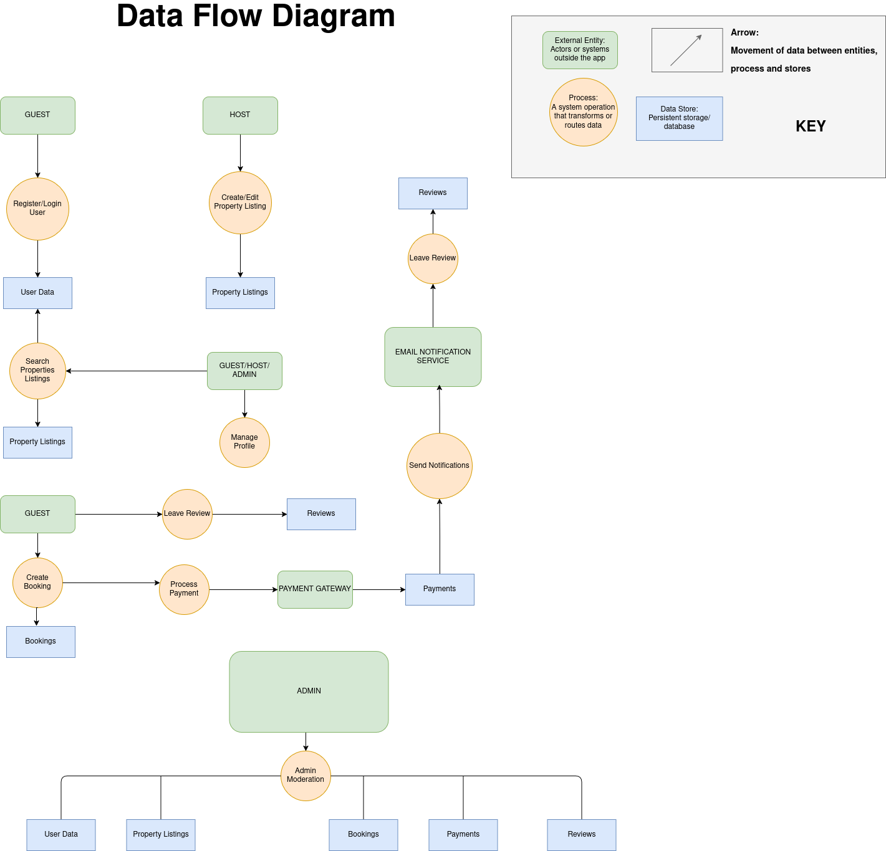

# 📈 Data Flow Diagram — Airbnb Clone Backend

## 🎯 Objective

This directory contains the Level 1 Data Flow Diagram (DFD) for the Airbnb Clone backend. The DFD visually maps how data flows through the system, including the interactions between users, backend processes, and data stores.

---

## 🔍 Included Elements

- **External Entities**: Guest, Host, Admin, Payment Gateway, Email Notification Service
- **Processes**: Authentication, Listing Management, Booking, Payment Processing, Notifications
- **Data Stores**: User Data, Listings, Bookings, Payments, Reviews
- **Data Flows**: All relevant interactions and data movements across components

---

## 📷 Diagram

> 
