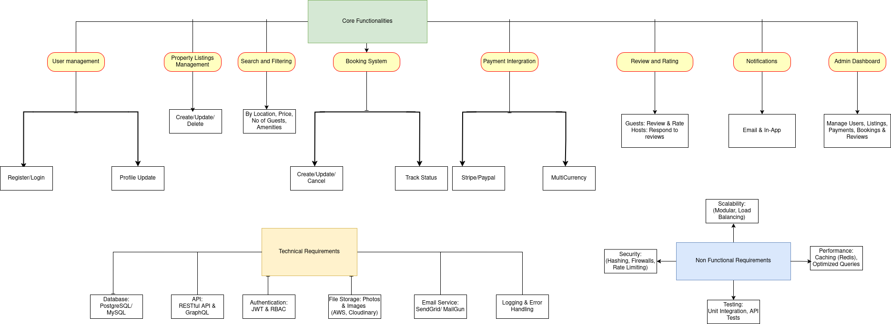

# 🧠 Airbnb Clone — Backend Features and Functionalities

## 📌 Objective

This document outlines the **core backend features** required for the Airbnb Clone project. These functionalities support user interactions, data management, and platform scalability.

---

## 🔑 Core Functionalities

### 1. 🧑‍💼 User Management

- **Registration** as guest or host
- **Secure authentication** using JWT
- **OAuth login** (Google, Facebook)
- **Profile updates** (photo, contact, preferences)

### 2. 🏘️ Property Listings Management

- Hosts can **create, update, delete** listings
- Include details: title, location, price, amenities, availability

### 3. 🔍 Search and Filtering

- Filter properties by:
  - Location
  - Price range
  - Number of guests
  - Amenities (e.g., Wi-Fi, pet-friendly)
- **Pagination** for search results

### 4. 📅 Booking System

- Create bookings for specific dates
- Prevent **double bookings**
- **Cancel bookings** (guest or host)
- Track status: pending, confirmed, canceled, completed

### 5. 💳 Payment Integration

- Secure payment via **Stripe, PayPal**
- Handle **guest charges** and **host payouts**
- Support **multiple currencies**

### 6. ⭐ Reviews and Ratings

- Guests can **rate and review** properties
- Hosts can **respond** to reviews
- Reviews linked to verified bookings

### 7. 🔔 Notifications System

- **Email & in-app alerts** for:
  - Booking confirmations
  - Cancellations
  - Payment updates

### 8. 🛠️ Admin Dashboard

- Admins can manage:
  - Users
  - Listings
  - Payments
  - Bookings
  - Reviews

---

## 🛠️ Technical Requirements

- **Database**: PostgreSQL/MySQL
- **API**: RESTful (GraphQL optional)
- **Authentication**: JWT, RBAC
- **File Storage**: For photos/images
- **Email Service**: SendGrid/Mailgun
- **Logging & Error Handling**

---

## 🚀 Non-Functional Requirements

- **Scalability**: Modular, load-balanced
- **Security**: Hashing, firewalls, rate limiting
- **Performance**: Caching (Redis), optimized queries
- **Testing**: Unit, integration, API tests

---

## 📷 Diagram

> 
