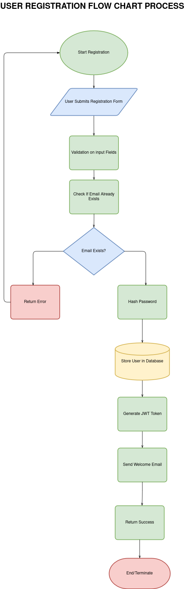

# 🧩 Backend Flowchart – User Registration

This flowchart illustrates the internal backend process for the **User Registration** functionality of the Airbnb Clone.

## 🗂️ Overview

The diagram outlines how data flows when a new user (guest or host) signs up, including input validation, duplication checks, password security, database storage, token generation, and response delivery.

## ✅ Key Steps

1. **User submits registration form** with details like name, email, password, and role.
2. **Input validation** is performed on the backend.
3. The system checks whether the email is already in use.
4. If unique:
   - Password is **hashed** securely.
   - User record is **stored** in the database.
   - A **JWT token** is generated for session handling.
   - An optional **welcome email** is sent.
5. If the email is already registered, an error response is returned.

## 📷 Diagram

> 

## 🔁 Notes

- This flow does not cover email verification or multi-factor authentication (MFA), though they can be added as extensions.
