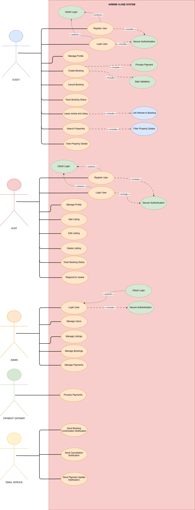

# 📘 Use Case Diagram — Airbnb Clone Backend

## 🎯 Objective

This document and accompanying diagram illustrate the system interactions for the backend of the Airbnb Clone application. It focuses on key functionalities such as user registration, property booking, payment processing, notifications, and administrative tasks.

---

## 👥 Actors

1. **Guest** — Browses and books properties, leaves reviews.
2. **Host** — Lists and manages properties, handles bookings, responds to reviews.
3. **Admin** — Manages users, listings, bookings, and payments.
4. **Payment Gateway** (External System) — Handles secure financial transactions (e.g., Stripe, PayPal).
5. **Email Service** (External System) — Sends transactional notifications (e.g., SendGrid, Mailgun).

---

## 🧩 Use Case Categories and Key Interactions

### 1. 🧑‍💼 User Management

- **Register User**
  - `<<include>>` Secure Authentication
  - `<<extend>>` OAuth Login
- **Login User**
  - `<<include>>` Secure Authentication
  - `<<extend>>` OAuth Login
- **Manage Profile**

### 2. 🏘️ Property Listings Management

- **Add Listing**
- **Edit Listing**
- **Delete Listing**
- **Search Properties**
  - `<<include>>` Filter Properties
- **View Property Details**

### 3. 📅 Booking Management

- **Create Booking**
  - `<<include>>` Date Validation
  - `<<include>>` Process Payment
- **Cancel Booking**
- **Track Booking Status**

### 4. 💳 Payment Integration

- **Process Payment**
  - Interacts with **Payment Gateway**
  - `<<include>>` Multi-currency Support

### 5. ⭐ Reviews and Ratings

- **Leave Review and Rating**
  - `<<include>>` Link Review to Booking
- **Respond to Review**

### 6. 🔔 Notifications System

- **Send Booking Confirmation Notification**
  - Interacts with **Email Service**
- **Send Cancellation Notification**
  - Interacts with **Email Service**
- **Send Payment Update Notification**
  - Interacts with **Email Service**

### 7. 🛠️ Admin Dashboard

- **Manage Users**
- **Manage Listings**
- **Manage Bookings**
- **Manage Payments**

---

## 🔗 Relationships

### Associations (Solid Line):

- **Guest** → All guest use cases
- **Host** → All host use cases
- **Admin** → Admin management use cases
- **Payment Gateway** → `Process Payment`
- **Email Service** → Notification use cases

### <<include>> Relationships (Dashed Line with <<include>>):

- `Register User` → `Secure Authentication`
- `Login User` → `Secure Authentication`
- `Create Booking` → `Date Validation`
- `Create Booking` → `Process Payment`
- `Search Properties` → `Filter Properties`
- `Leave Review and Rating` → `Link Review to Booking`

### <<extend>> Relationships (Dashed Line with <<extend>>):

- `Register User` ← `OAuth Login`
- `Login User` ← `OAuth Login`

---

## 🖼️ Diagram

> 

The use case diagram above was created using Draw.io and exported in PNG format. It includes all primary actors, core system functionalities, and their relationships — both internal and external.

---
